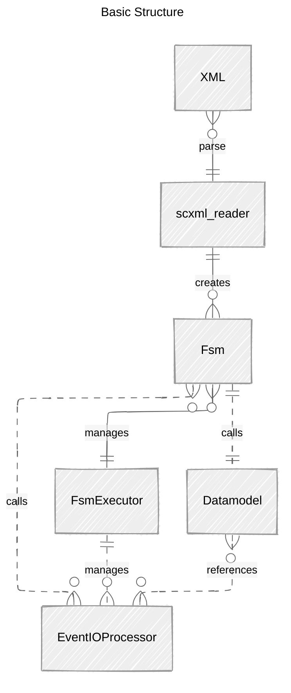

# The Software Design

SCXML is parsed via a SAX parser.
The resulting model is then executed by a worker thread where the FSM waits for events.
Multiple FSM can work in parallel and communicate via their external event-queues (using communication queues).

A Datamodel-instance is associated with each FSM-instance.

All active Fsm-sessions are managed by the FsmExecutor. 

## Details

The Fsm implements the algorithm described in the W3C Recommendation. The main loop is executed in a work-thread. The application sends events via a "BlockingQueue".
All scripts and conditional expressions are executed by the Datamodel. W3C defines that implementations may freely choose the script language to support. 

Names from the W3C pseudo-code-algorithm are kept were feasible.

## Structure

### Datamodel 

SCXML defines an API to _"storing, reading, and modifying a set of data that is internal to the state machine"_.
See the abstract base class [Datamodel](src/main/java/com/bw/fsm/datamodel/Datamodel.java) for details.

The projekt contains these Datamodel implementations:
+ [ECMAScript-Datamodel](src/main/java/com/bw/fsm/datamodel/ECMADatamodel.java) 
  _TODO_ 
  It uses TODO. You check the requirements for ECMA in SCXML [here](https://www.w3.org/TR/scxml/#ecma-profile)
+ [Expression-Engine-Datamodel](src/main/java/com/bw/fsm/datamodel/ExpressionEngine.java)
  A datamodel based on a fast expression like language. As this language is a java based re-implementation of our RUST version,
  it is __not__ using JE (Java Expression Language).
  _TODO_ 
+ The _"Nulldatamodel"_ 
  The mandatory Null-Datamodel is a dummy implementation with no real functionality.
  It's only here because W3C requires it.
  _TODO_ 

### Logging

_TODO_

### Manual Tests

_TODO_

`java com.bw.fsm.Fsm MySM.scxml`

The scxml will be parsed and the resulting FSM will be executed. The app prompts for events that are send via the external-event-queue. Enter 'help' to display some usage
information.

### Automated Testing

_TODO_

For automated tests the application [Tester](src/test/java/com/bw/fsm/Tester.java) can be used. 
The schema for the configuration files is _[schema/test_specification_schema.json](schema/test_specification_schema.json)_.

For a practical application of automated testing see how the W3C tests are applied:
[W3C Tests Readme](W3C_TESTS_README.md).
